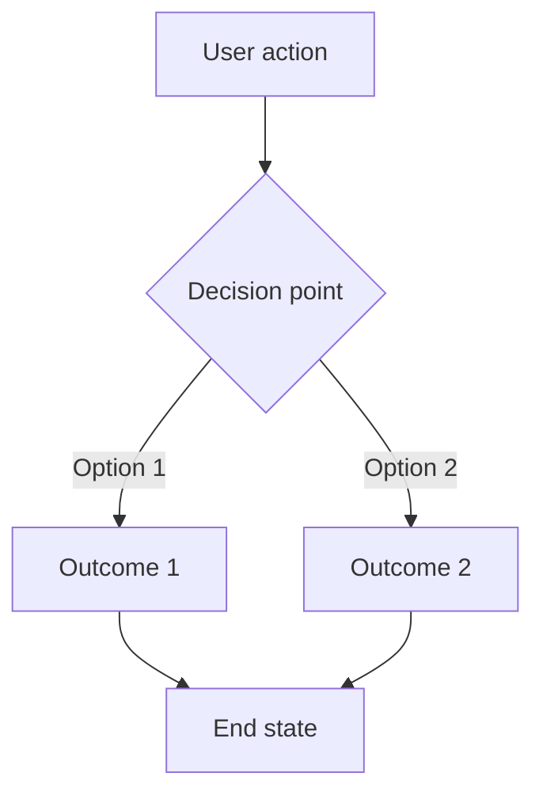
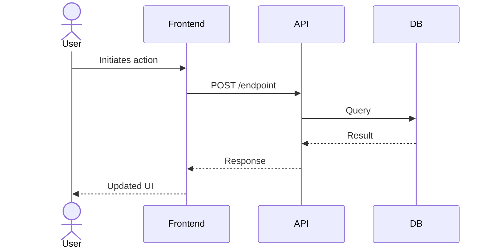

# User Story Creator & Refiner

Create well-structured, comprehensive user stories through guided discovery and codebase analysis. Accepts a URL, ticket number, or plain-text summary as input.

## Step 1: Determine Input Type

Classify the input provided by the user:

| Input Type | Detection | Action |
|---|---|---|
| **GitHub Issue URL** | Contains `github.com` and `/issues/` | Fetch with `gh issue view <number> --json title,body,labels,milestone,comments,assignees` |
| **GitHub Issue Number** | Bare number like `#123` or `123` | Fetch with `gh issue view <number> --json title,body,labels,milestone,comments,assignees` |
| **Linear URL or ID** | Contains `linear.app` or pattern like `ENG-123` | Fetch via `linear` MCP tool if available, or `WebFetch` the URL |
| **Jira URL or Key** | Contains `atlassian.net` or pattern like `PROJ-123` | Fetch via `jira` MCP tool if available, or `WebFetch` the URL |
| **Azure DevOps URL or ID** | Contains `dev.azure.com` or `visualstudio.com`, or pattern like `AB#123` | Fetch via `azure-devops` MCP tool or Playwright (if available) |
| **Generic URL** | Any other URL | Fetch with `WebFetch` and extract relevant context |
| **Plain-text summary** | No URL or ticket pattern detected | Use directly as the initial story description |

## Steps 2-3: Gather Context (Parallel)

These two steps are independent — run them in parallel when the input is a pre-existing ticket.

### 2. Gather Existing Ticket Context

For pre-existing tickets:
1. **Read the full ticket** — title, description, comments, labels, status, assignee
2. **Check for parent/epic** — If the ticket belongs to an epic, milestone, or parent story, read that too for broader context
3. **Read sibling stories** — If part of a hierarchy, scan sibling tickets to understand scope boundaries
4. **Note existing acceptance criteria** — Capture any criteria already defined so they can be preserved or improved

For net-new stories, skip this sub-step.

### 3. Codebase Analysis

If the working directory has no meaningful codebase (empty, no source files, or the story is unrelated to the current project), skip this step and note in the story's Technical Notes that codebase analysis was not performed.

Review the relevant parts of the codebase to understand implications:
1. **Identify affected areas** — Use `Glob` and `Grep` to find files, components, APIs, and data models related to the story
2. **Map dependencies** — Note which systems, services, or modules would be touched
3. **Check for existing patterns** — Look for similar features already implemented that could inform the approach
4. **Note technical constraints** — Identify anything in the current architecture that would shape or constrain the implementation

Summarize findings concisely. This context will inform the questions in Step 4.

## Step 4: Quick Clarification

Ask the user **one round** of questions — only the things you genuinely cannot infer from the ticket, codebase, or context. Skip anything you can make a reasonable assumption about; you'll state those assumptions in the draft and the user can correct them there.

Good questions to ask (pick only the relevant ones):
- Who is the primary user/persona? (if ambiguous)
- What is explicitly out of scope?
- Any hard constraints (deadlines, platform limitations, compliance requirements)?

**Use `AskUserQuestion` with multiple-choice where appropriate, plain text for open-ended questions.** Combine everything into a single message — do not do multiple rounds.

State your assumptions (inferred from codebase analysis, ticket context, or conventions) directly in the draft story rather than asking the user to confirm each one upfront. Mark them with **[Assumption]** so the user can spot and correct them during review.

## Step 5: Write the User Story

Using all gathered context, produce the user story in the following format. Refer to [STORY_TEMPLATE.md](STORY_TEMPLATE.md) for the full template.

### Required Sections:

1. **Title** — Clear, concise name for the story
2. **User Story Statement** — "As a [persona], I want [goal], so that [benefit]."
3. **Background & Context** — Why this story exists, linking to parent epic/initiative if applicable
4. **Acceptance Criteria** — Specific, testable criteria using Given/When/Then format (security and PM criteria will be merged in Step 6)
5. **User Flow** — Mermaid diagram showing the primary user flow (see below)
6. **Out of Scope** — What this story explicitly does NOT cover
7. **Technical Notes** — Architecture considerations, affected components, relevant code pointers
8. **Security Assessment** — Added by the Security Engineer agent in Step 6
9. **SMART Assessment** — Added by the Product Manager agent in Step 6
10. **Edge Cases** — Including security-relevant edge cases
11. **Open Questions** — Any unresolved questions that need follow-up

### User Flow Diagrams

For any story with non-trivial user interaction, include a Mermaid flowchart:

For complex multi-actor flows, use Mermaid sequence diagrams:

Use the diagram type that best clarifies the story. Include diagrams for:
- Multi-step workflows
- Branching logic or decision trees
- Multi-system interactions
- State transitions

**Note:** Not all ticket systems render Mermaid natively (e.g., Jira does not). If the story will be posted to a system without Mermaid support, replace diagrams with ASCII flowcharts or describe the flow in a numbered list instead.

## Step 6: Security & PM Review (Parallel)

Before presenting the draft, launch the **Security Engineer** and **Product Manager** agents **in parallel** using two `Agent` tool calls in the same message. These agents are independent — neither needs the other's output.

### Skip Conditions

- **Skip security review** if the story is purely cosmetic (copy changes, style tweaks, documentation-only) with no backend, data, or authentication implications. When in doubt, run it.
- **Skip PM review** if the story is a trivial bug fix or narrowly-scoped technical chore (e.g., dependency update, config change) where strategic alignment is self-evident.

### Launching the Agents

Launch both agents in a single message, each with the `Agent` tool. Each agent prompt should include:

1. A role statement ("You are a security engineer..." / "You are a product manager...")
2. An instruction to read its own instructions file from this skill's directory
3. The draft user story (full text)
4. The codebase context summary from Step 3
5. The working directory path (for security engineer) or the user's original input (for product manager)

**Security Engineer** — read instructions from `agents/security-engineer.md`, review the story for threats, provide acceptance criteria and hardening recommendations.

**Product Manager** — read instructions from `agents/product-manager.md`, evaluate the story against the SMART framework, check alignment with the original request.

### Integrating the Results

Once both agents return, merge their findings into the story:

**From the Security Engineer:**
1. Add the **Security Assessment** section after Technical Notes
2. Merge security acceptance criteria into the main Acceptance Criteria section, prefixed with `[Security]`
3. Add hardening recommendations to Technical Notes
4. Add security-relevant edge cases to the Edge Cases table
5. If threat level is **Critical**, flag it prominently at the top of the story

**From the Product Manager:**
1. Add the **SMART Assessment** section after Security Assessment
2. Merge suggested acceptance criteria, prefixed with `[PM]`
3. If the PM recommends splitting the story, add the suggestion to Open Questions
4. For any SMART dimension rated "Needs Work," apply the recommended fix directly

## Step 7: Deliver and Iterate

1. **Write the story to a tempfile** at `/tmp/user-story-{slugified-title}.md` (e.g., `/tmp/user-story-team-invitation-flow.md`). Tell the user the file path.
2. **Present the draft** to the user in full
3. **Ask for feedback** — Are there sections that need refinement?
4. **Iterate** until the user is satisfied, updating the tempfile after each round
5. **Offer next steps:**
   - Copy to clipboard: `cat /tmp/user-story-{slugified-title}.md | pbcopy`
   - Create a ticket: `gh issue create` or equivalent CLI for the user's ticket system
   - Move to a permanent location if requested

## Example

For a complete example of a finished user story (magic link authentication), see [examples.md](examples.md).

## Error Handling

| Situation | Action |
|---|---|
| Ticket URL/number cannot be fetched | Inform the user and ask them to paste the ticket contents directly |
| Codebase is not available or empty | Skip Step 3 and note that technical analysis was not possible |
| User provides very vague input | Start with broad clarifying questions before attempting codebase analysis |
| MCP tool not available for ticket system | Fall back to `WebFetch` or ask user to paste content |
| Security engineer agent fails or times out | Note that the security review could not be completed, add a prominent Open Question: "Security review pending — run before implementation begins" |
| Product manager agent fails or times out | Note that the SMART review could not be completed, add a prominent Open Question: "PM review pending — validate story alignment before implementation begins" |
