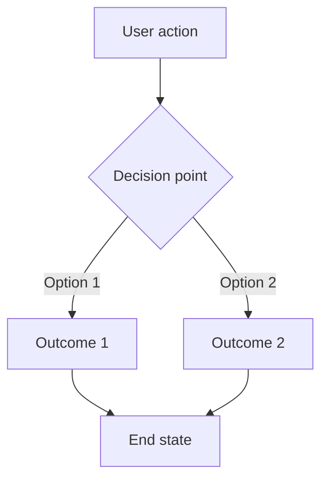
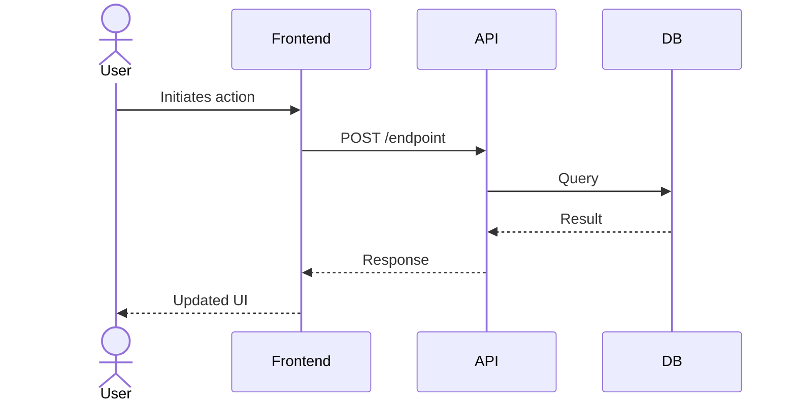

# User Story Creator & Refiner

Create well-structured, comprehensive user stories through guided discovery and codebase analysis. Accepts a URL, ticket number, or plain-text summary as input.

## Step 1: Determine Input Type

Classify the input provided by the user:

| Input Type | Detection | Action |
|---|---|---|
| **GitHub Issue URL** | Contains `github.com` and `/issues/` | Fetch with `gh issue view <number> --json title,body,labels,milestone,comments,assignees` |
| **GitHub Issue Number** | Bare number like `#123` or `123` | Fetch with `gh issue view <number> --json title,body,labels,milestone,comments,assignees` |
| **Linear URL or ID** | Contains `linear.app` or pattern like `ENG-123` | Fetch via `linear` MCP tool if available, or `WebFetch` the URL |
| **Jira URL or Key** | Contains `atlassian.net` or pattern like `PROJ-123` | Fetch via `jira` MCP tool if available, or `WebFetch` the URL |
| **Generic URL** | Any other URL | Fetch with `WebFetch` and extract relevant context |
| **Plain-text summary** | No URL or ticket pattern detected | Use directly as the initial story description |

## Step 2: Gather Existing Context

### For pre-existing tickets:

1. **Read the full ticket** — title, description, comments, labels, status, assignee
2. **Check for parent/epic** — If the ticket belongs to an epic, milestone, or parent story, read that too for broader context
3. **Read sibling stories** — If part of a hierarchy, scan sibling tickets to understand scope boundaries
4. **Note existing acceptance criteria** — Capture any criteria already defined so they can be preserved or improved

### For net-new stories:

Skip to Step 3.

## Step 3: Codebase Analysis

Review the relevant parts of the codebase to understand implications:

1. **Identify affected areas** — Use `Glob` and `Grep` to find files, components, APIs, and data models related to the story
2. **Map dependencies** — Note which systems, services, or modules would be touched
3. **Check for existing patterns** — Look for similar features already implemented that could inform the approach
4. **Note technical constraints** — Identify anything in the current architecture that would shape or constrain the implementation

Summarize findings concisely. This context will inform the questions in Step 4.

## Step 4: Discovery Questions

Based on what you've learned, develop and ask the user a series of targeted questions. Organize them into these categories:

### 4a: Clarifying Questions
Direct questions about unclear or missing aspects of the story:
- What specific problem does this solve?
- Who is the primary user/persona?
- What is the expected trigger or entry point?
- What does success look like?

### 4b: Suppositions
State assumptions you've inferred and ask the user to confirm or correct them:
- "I'm assuming this feature would live in [area] based on [evidence] — is that correct?"
- "It looks like [existing pattern] is the convention here — should we follow it?"

### 4c: Hidden Assumptions
Surface assumptions the user may not have considered:
- Edge cases discovered from codebase analysis
- Permissions and access control implications
- Impact on existing features or workflows
- Performance, scale, or data migration considerations
- Mobile/responsive/accessibility implications

### 4d: Scope & Priority
Help the user define boundaries:
- What is explicitly out of scope?
- Is there a smaller MVP version of this?
- Are there dependencies that must ship first?

**Ask these questions using the `AskUserQuestion` tool where multiple-choice is appropriate, and as plain text when open-ended responses are needed. Batch questions logically — aim for 2-3 rounds of questions maximum.**

## Step 5: Write the User Story

Using all gathered context, produce the user story in the following format. Refer to [STORY_TEMPLATE.md](STORY_TEMPLATE.md) for the full template.

### Required Sections:

1. **Title** — Clear, concise name for the story
2. **User Story Statement** — "As a [persona], I want [goal], so that [benefit]."
3. **Background & Context** — Why this story exists, linking to parent epic/initiative if applicable
4. **Acceptance Criteria** — Specific, testable criteria using Given/When/Then format (security criteria will be merged in Step 6)
5. **User Flow** — Mermaid diagram showing the primary user flow (see below)
6. **Out of Scope** — What this story explicitly does NOT cover
7. **Technical Notes** — Architecture considerations, affected components, relevant code pointers
8. **Security Assessment** — Added by the Security Engineer agent in Step 6
9. **Edge Cases** — Including security-relevant edge cases
10. **Open Questions** — Any unresolved questions that need follow-up

### User Flow Diagrams

For any story with non-trivial user interaction, include a Mermaid flowchart:



For complex multi-actor flows, use Mermaid sequence diagrams:



Use the diagram type that best clarifies the story. Include diagrams for:
- Multi-step workflows
- Branching logic or decision trees
- Multi-system interactions
- State transitions

## Step 6: Security Review

Before presenting the draft to the user, invoke the **Security Engineer** agent to review the story for security implications.

### Invocation

Launch the security engineer agent using the `Agent` tool with the following prompt structure:

```
You are a security engineer reviewing a user story. Follow the instructions in [agents/security-engineer.md](agents/security-engineer.md).

## Draft User Story
<paste the full draft story here>

## Codebase Context
<paste the summary of affected components, files, and architecture from Step 3>

## Working Directory
<the current working directory path>
```

### Integrating the Results

Once the security engineer agent returns its assessment:

1. **Add the Security Assessment section** to the story — insert it after Technical Notes and before Edge Cases. Include the full assessment: threat level, threats & mitigations table, data classification (if applicable), and hardening recommendations.

2. **Harden the acceptance criteria** — merge the agent's Security Acceptance Criteria into the story's main Acceptance Criteria section. Prefix each with a `[Security]` tag so they are visually distinct:
   - [ ] `[Security]` **Given** [precondition], **when** [attack scenario], **then** [secure behavior]

3. **Update Technical Notes** — add any hardening recommendations that reference specific files or patterns to the Technical Notes section.

4. **Update Edge Cases** — add any security-relevant edge cases (e.g., expired tokens, malformed input, privilege escalation attempts) to the Edge Cases table.

5. **Threat level as a signal** — If the security engineer rates the story as **Critical** threat level, flag this prominently at the top of the story and note that the security concerns should be addressed before implementation begins.

### Skip Conditions

Skip the security review if the story is purely cosmetic (copy changes, style tweaks, documentation-only) with no backend, data, or authentication implications. When in doubt, run the review — it is better to get a "Low threat, no concerns" assessment than to miss something.

## Step 7: Deliver and Iterate

1. **Present the draft** to the user in full
2. **Ask for feedback** — Are there sections that need refinement?
3. **Iterate** until the user is satisfied
4. **Output the final story** — If a ticket system is available, offer to create/update the ticket directly using the appropriate CLI tool (`gh issue create`, etc.)

## Error Handling

| Situation | Action |
|---|---|
| Ticket URL/number cannot be fetched | Inform the user and ask them to paste the ticket contents directly |
| Codebase is not available or empty | Skip Step 3 and note that technical analysis was not possible |
| User provides very vague input | Start with broad clarifying questions before attempting codebase analysis |
| MCP tool not available for ticket system | Fall back to `WebFetch` or ask user to paste content |
| Security engineer agent fails or times out | Note that the security review could not be completed, add a prominent Open Question: "Security review pending — run before implementation begins" |
