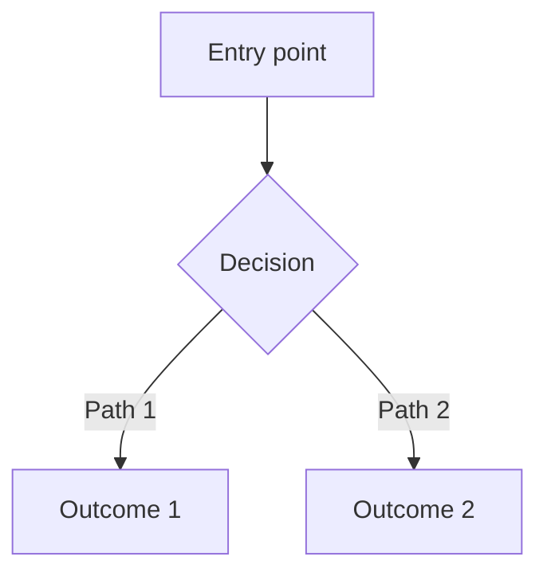

# User Story Template

Use this template when writing the final user story in Step 5.

---

## [Story Title]

**Epic/Initiative:** [Link to parent epic if applicable]
**Priority:** [Critical / High / Medium / Low]
**Estimated Complexity:** [Small / Medium / Large / X-Large]

### User Story

> As a **[persona]**,
> I want **[goal/action]**,
> so that **[benefit/value]**.

### Background & Context

[2-4 sentences explaining why this story exists. Reference the parent epic or initiative if this is part of a larger effort. Include any relevant business context or user research that motivated this work.]

### Acceptance Criteria

Use Given/When/Then format for testable criteria:

- [ ] **Given** [precondition], **when** [action], **then** [expected result]
- [ ] **Given** [precondition], **when** [action], **then** [expected result]
- [ ] **Given** [precondition], **when** [action], **then** [expected result]

### User Flow

### Out of Scope

- [Thing explicitly not included in this story]
- [Another thing deferred to a future story]

### Technical Notes

- **Affected components:** [List of files, modules, or services]
- **Dependencies:** [External services, APIs, or other stories that must be completed first]
- **Data changes:** [Any database schema changes, migrations, or data transformations]
- **Architecture considerations:** [Relevant patterns, constraints, or decisions]

### Security Assessment

> This section is populated by the Security Engineer agent in Step 6. Do not fill manually.

**Threat Level:** [Low / Medium / High / Critical]

[1-2 sentence summary of overall security posture]

#### Threats & Mitigations

| # | Threat | STRIDE Category | Severity | Mitigation |
|---|---|---|---|---|
| 1 | [Specific threat] | [S/T/R/I/D/E] | [Low/Med/High/Critical] | [Concrete mitigation] |

#### Data Classification

> Include only if the story involves sensitive data. Omit this sub-section otherwise.

| Data Element | Classification | Handling Requirements |
|---|---|---|
| [e.g., email address] | PII | Encrypt at rest, mask in logs |

#### Hardening Recommendations

1. [Specific, codebase-grounded recommendation]
2. [Another recommendation]

### Edge Cases

| Scenario | Expected Behavior |
|---|---|
| [Edge case 1] | [What should happen] |
| [Edge case 2] | [What should happen] |

### Open Questions

- [ ] [Unresolved question needing follow-up]
- [ ] [Another open question]

---

<!-- AGENT INSTRUCTIONS — Do not include anything below this line in the output. -->
<!--
When filling in this template:
1. Be specific in acceptance criteria — Vague criteria like "works correctly" are not testable. Each criterion should be verifiable by a developer or QA engineer.
2. Include realistic edge cases — Draw from codebase analysis to identify real scenarios, not hypothetical ones.
3. Keep technical notes actionable — Point to specific files, functions, or APIs when possible (e.g., src/components/Auth.tsx:42).
4. Size the diagram appropriately — Simple CRUD operations may not need a diagram. Complex multi-step or multi-actor flows always should.
5. Prefer Given/When/Then — This format maps directly to test cases and removes ambiguity.
-->
