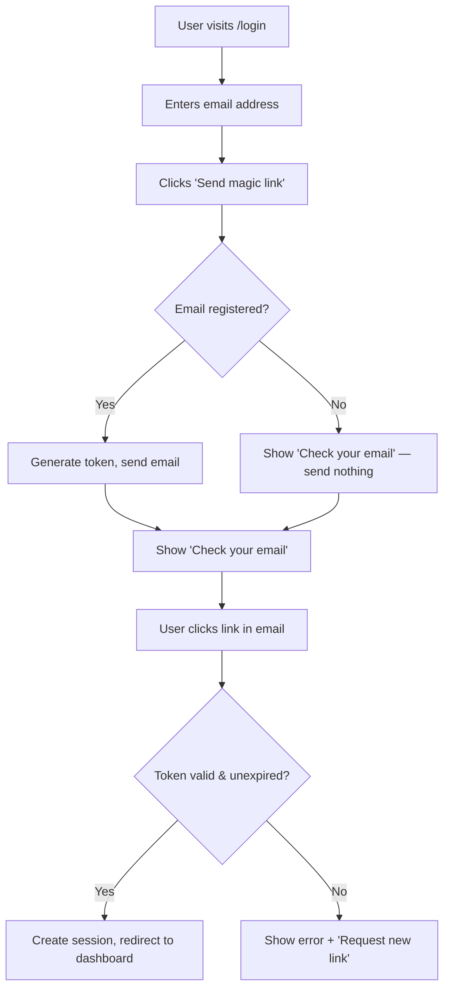

# Examples

## Example: User Authentication with Magic Links

This example shows a completed user story for adding passwordless authentication to a fictional SaaS application called "Teamboard."

### Input

The user invoked the skill with:

```
Add magic link authentication so users can sign in without a password
```

### Output

The skill produced the following story (written to `/tmp/user-story-magic-link-authentication.md`):

---

## Magic Link Authentication

**Epic/Initiative:** User Onboarding Improvements (TEAM-100)
**Priority:** High
**Estimated Complexity:** Medium

### User Story

> As a **Teamboard user**,
> I want **to sign in with a magic link sent to my email**,
> so that **I don't need to remember a password and can access my account more quickly**.

### Background & Context

Teamboard currently supports only email/password authentication. User research shows 34% of support tickets are password-reset related, and drop-off during signup is highest at the "create password" step. Magic link authentication removes this friction by sending a one-time login link to the user's verified email address. This story is part of the User Onboarding Improvements epic (TEAM-100), which also includes SSO (TEAM-112, future).

### Acceptance Criteria

- [ ] **Given** a registered user on the login page, **when** they enter their email and click "Send magic link," **then** they receive an email within 30 seconds containing a one-time login URL
- [ ] **Given** a user with a valid magic link, **when** they click the link within 15 minutes, **then** they are authenticated and redirected to their dashboard
- [ ] **Given** a user with an expired magic link (>15 minutes old), **when** they click the link, **then** they see a "Link expired" message with an option to request a new one
- [ ] **Given** a user who has already used a magic link, **when** they click the same link again, **then** they see a "Link already used" message
- [ ] **Given** an unregistered email address, **when** someone submits it on the login form, **then** the UI shows the same "Check your email" message (no user enumeration) but no email is sent
- [ ] `[Security]` **Given** a brute-force attempt on the magic link endpoint, **when** more than 5 requests are made for the same email within 10 minutes, **then** further requests are rate-limited and return HTTP 429
- [ ] `[Security]` **Given** a valid magic link token, **when** it is submitted from a different IP than the one that requested it, **then** authentication still succeeds (do not bind to IP — users may switch networks) but the event is logged for anomaly detection
- [ ] `[Security]` **Given** a magic link URL, **when** the token portion is tampered with, **then** the server returns a generic "Invalid or expired link" error without revealing whether the token format was wrong or the token was not found

### User Flow



### Out of Scope

- SSO / OAuth integration (tracked in TEAM-112)
- Removing password-based login (magic links are an additional option, not a replacement)
- Mobile deep linking for the magic link URL
- "Remember this device" / long-lived sessions

### Technical Notes

- **Affected components:** `app/controllers/sessions_controller.rb`, `app/models/user.rb`, `app/mailers/auth_mailer.rb` (new), `app/views/sessions/new.html.erb`
- **Dependencies:** Existing `ActionMailer` configuration for transactional email (already used for password resets)
- **Data changes:** New `magic_link_tokens` table with columns: `id`, `user_id`, `token` (indexed, unique), `expires_at`, `consumed_at`, `created_at`. No migration to existing tables.
- **Architecture considerations:**
  - Token generation: use `SecureRandom.urlsafe_base64(32)` — matches existing password reset token pattern in `app/models/concerns/recoverable.rb:18`
  - Store hashed token (SHA-256), not plaintext — compare on lookup
  - Reuse existing `SessionsController` with a new `#magic_link` action, or create `MagicLinksController` as a noun resource (`POST /magic_links`, `GET /magic_links/:token`)
  - Email delivery via Sidekiq (`AuthMailer.magic_link.deliver_later`) to avoid blocking the request

### Security Assessment

**Threat Level:** High

This story introduces a new authentication pathway. Magic links are bearer tokens delivered over email — compromise of the token grants full account access.

#### Threats & Mitigations

| # | Threat | STRIDE Category | Severity | Mitigation |
|---|---|---|---|---|
| 1 | Token interception via email compromise | Information Disclosure | High | Short expiry (15 min), single-use tokens, encourage users to use HTTPS email providers |
| 2 | User enumeration via timing or response differences | Information Disclosure | Medium | Return identical response and timing for registered and unregistered emails |
| 3 | Brute-force token guessing | Spoofing | High | 256-bit tokens (2^256 search space), rate limiting on the verification endpoint |
| 4 | Token leakage via referrer headers | Information Disclosure | Medium | Use `Referrer-Policy: no-referrer` on the magic link landing page; consume token server-side before any redirects |
| 5 | Replay attack with consumed tokens | Spoofing | Medium | Mark tokens as consumed atomically on first use (`UPDATE ... WHERE consumed_at IS NULL`) |

#### Data Classification

| Data Element | Classification | Handling Requirements |
|---|---|---|
| Email address | PII | Already handled per existing privacy policy |
| Magic link token (hashed) | Authentication credential | Store only SHA-256 hash; never log plaintext; purge expired tokens via scheduled job |

#### Hardening Recommendations

1. Store tokens as SHA-256 hashes in the database, matching the pattern in `app/models/concerns/recoverable.rb` for password reset tokens
2. Add `Referrer-Policy: no-referrer` header to the magic link verification endpoint to prevent token leakage
3. Use database-level `UPDATE ... WHERE consumed_at IS NULL RETURNING *` to atomically consume tokens and prevent race conditions
4. Add a Sidekiq periodic job to purge expired/consumed tokens older than 24 hours

### Edge Cases

| Scenario | Expected Behavior |
|---|---|
| User requests multiple magic links in succession | Each new request invalidates previous unexpired tokens for that user |
| User clicks magic link in a different browser than where they requested it | Authentication succeeds — tokens are not browser-bound |
| Email delivery is delayed beyond 15-minute expiry | User sees "Link expired" and can request a new one |
| User's account is deactivated between token request and click | Token verification checks account status; deactivated accounts are rejected |
| User has both password and magic link options | Both remain functional; magic link does not affect password-based login |

### Open Questions

- [ ] Should magic link emails include a "This wasn't me" link for abuse reporting?
- [ ] What is the desired session duration after magic link login — same as password login (7 days) or shorter?

---

<!-- AGENT INSTRUCTIONS — Do not include anything below this line in the output. -->
<!--
This example demonstrates:
1. Specific, testable Given/When/Then acceptance criteria (not vague)
2. Security criteria merged inline with [Security] tags
3. Mermaid diagram for a non-trivial user flow
4. Technical notes referencing actual file paths and line numbers
5. A proportionate security assessment (High, not Critical — new auth path but uses established patterns)
6. Realistic edge cases drawn from how the feature would actually work
7. Open questions that are genuine unknowns, not padding
-->
